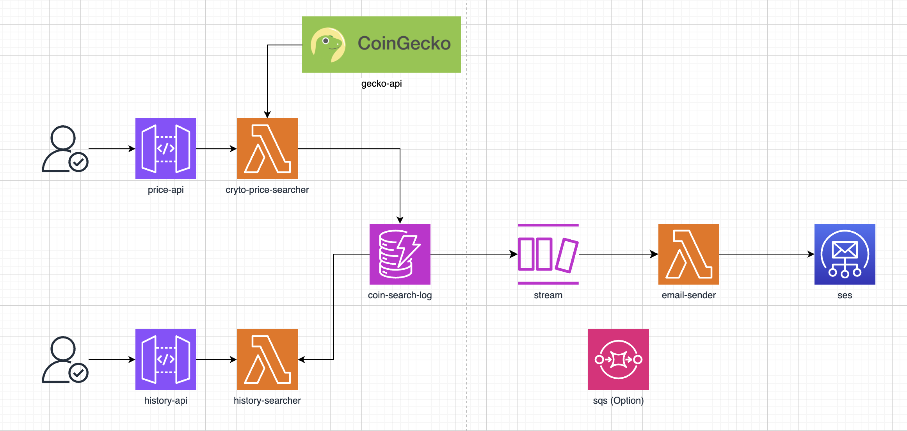

# 🚀 Nimo Test Exercise 🚀

I was given this test by **NIMO INDUSTRIES PTY. LTD.**, and the document below provides details about the project.

### I. Business Requirements 📄

Create an API with 2 microservices: 

Microservice 1: Email Cryptocurrency Current Price 
##### User Story: I, as an investor, would like to query the current price of a specific cryptocurrency and receive a graceful email about the result. 

Microservice 2: Search History 
##### User Story: I, as an investor, would like to retrieve all the search history (when and what cryptocurrency) from Microservice 1. 

### II. Technical Specifications 📚
- ✅ (Mandatory) Microservices must be deployed 100% serverless on AWS. 
- ✅ (Mandatory) All code implementation must be using NodeJS.
- ✅ (Mandatory) All code must be version controlled using git and GitHub. 
- ✅ (Optional) CICD using any tool (preferably GitHub Actions). 
- 🔄 (Optional) Infrastructure as Code using any tool (preferably AWS SAM). 
- The architectural design of the API is open to the candidate. 

### III. Resources: 💡
- 🧰 Cryptocurrency data API: https://www.coingecko.com/en/api/documentation
- ✅ DynamoDB or RDS can be considered for data persistence.
- ✅ SES can be considered for sending emails.

### IV. Submission: 📝
- GitHub public repository link 
- API endpoint URL and documentation for usage 

## Architecture 🛠️


### Email Example 📧


## API Document 📬

#### **1. Email Cryptocurrency Current Price **
#### Endpoints 

- **Endpoint**: `POST https://eudidl0hl7.execute-api.ap-southeast-1.amazonaws.com/coin-prices`
- **Description**: Get cryto currnt price and send to email (in this test fix to send to my email)

- **Header**
    | Key | Type   | Required | Description                      |
   |-----------|--------|----------|----------------------------------|
   | `username`  | String | Yes      | The unique identifier of a user. |
- **Body**:

   | Parameter | Type   | Required | Description                      |
   |-----------|--------|----------|----------------------------------|
   | `ids`  | Array[String] | Yes      | cryto list that need to be observesd.([list of cryto](https://docs.google.com/spreadsheets/d/1wTTuxXt8n9q7C4NDXqQpI3wpKu1_5bGVmP9Xz0XGSyU/edit?gid=0#gid=0)) |
   | `currencies`  | Array[String] | Yes      | currencies of cryto list that need to be observesd. |
- **Example Body**
    ```json
    {
        "ids": [ "bitcoin", "ethereum", "dogecoin","bitkub-coin","binancecoin"],
        "currencies": ["usd","thb","aud"]
    }

- **Response** (email is sended): 
  
   ```json
    {
        "binancecoin": {
            "usd": 649.66,
            "thb": 22610,
            "aud": 992.64
        },
        "bitcoin": {
            "usd": 88539,
            "thb": 3081387,
            "aud": 135283
        },
        "bitkub-coin": {
            "usd": 2.35,
            "thb": 81.96,
            "aud": 3.6
        },
        "dogecoin": {
            "usd": 0.424868,
            "thb": 14.79,
            "aud": 0.649175
        },
        "ethereum": {
            "usd": 3406.04,
            "thb": 118539,
            "aud": 5204.25
        }
    }

#### **2. Search History **
#### Endpoints 

- **Endpoint**: `GET https://pquwruofjb.execute-api.ap-southeast-1.amazonaws.com/historys`
- **Description**: Get history log of senario 1

- **Header**
    | Key | Type   | Required | Description                      |
   |-----------|--------|----------|----------------------------------|
   | `username`  | String | Yes      | The unique identifier of a user. |
- **Params**:

   | Parameter | Type   | Required | Description                      |
   |-----------|--------|----------|----------------------------------|
   | `day`  | String | No      | date that need to be filtered. |
- **Example Parameter**
    `/historys?day=2024-11-12` is 12 November 2024

- **Response**: 
  
   ```json
    {
        "items": [
            {
                "unit": "aud",
                "createAt": "2024-11-12T01:00:21.289Z",
                "timestamp": 1731373221289,
                "sk": "2024-11-12:binancecoin:aud:1731373221289",
                "username": "bob",
                "price": 993.8,
                "coin": "binancecoin"
            },
            ...
            {
                "unit": "usd",
                "createAt": "2024-11-12T01:00:21.289Z",
                "timestamp": 1731373221289,
                "sk": "2024-11-12:ethereum:usd:1731373221289",
                "username": "bob",
                "price": 3345.74,
                "coin": "ethereum"
            }
        ],
        "count": 15
    }

## Another Option 🛠️


1. Lambda -> dynamodb -> dynamodb stream -> lambda -> ses
2. Lambda -> dynamodb -> dynamodb stream -> queue -> lambda -> ses